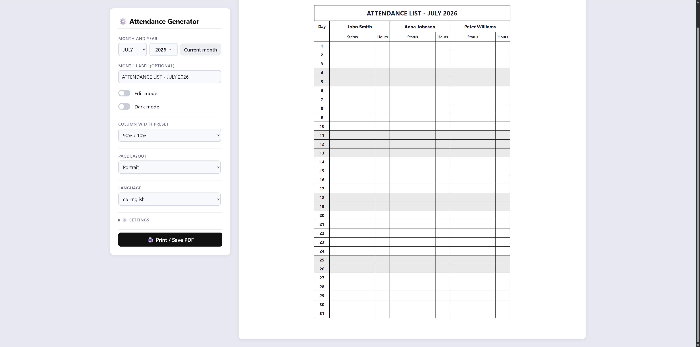

# 📋 TimeSheetLite

Generate printable attendance sheets — straight from your browser, no installation needed.

---

## ✨ Features

- **Special days** – weekends and holidays auto-marked, with manual toggle
- **Print / PDF** – A4 layout, ready for your company's sign-off table
- **Edit mode** – enter status and hours per person, edit day labels inline
- **Custom column headers** – rename "Status" and "Hours" columns to anything you need
- **Adjustable column widths** – use the slider to balance the space between the two sub-columns
- **Custom employee names** – add, remove, or rename directly in the table
- **Dark mode** + dark sheet background
- **PL / EN** – full support for both languages
- **Holidays** – local Polish holidays, or fetch from Nager.Date API (~40 countries)
- **Auto-save** – everything persists in browser `localStorage`
- **JSON backup** – export/import settings, move between computers

---

## 🚀 How to use

### 📥 Download

👉 **[Download index.html](https://raw.githubusercontent.com/Shurielx/TimeSheetLite/main/index.html)** — right-click → *Save as...*

**or** clone the repo:

```bash
git clone https://github.com/Shurielx/TimeSheetLite.git
```

Just open `index.html` in any browser. No server required.

---

## 📸 Screenshot



---

## ⚙️ Settings

| Option | Description |
|--------|-------------|
| Month / year | Pick a month or click 📅 to jump back to the current one |
| Month label | Optional custom title (e.g. "JULY 2026") |
| Edit mode | Enable to edit data in the table |
| Employees | Add or remove people |
| Language | Polish / English |
| Dark mode | Dark UI theme |
| Dark sheet | Dark sheet background (useful on screen) |
| Holiday source | Local Polish holidays or fetch via API |
| Column headers | Customize the "Status" and "Hours" sub-column names (Settings → Column headers) |
| Column width | Adjust the width ratio between the two sub-columns with a slider (Settings → Column width) |
| Page layout | Switch between Portrait (A4 vertical) and Landscape (A4 horizontal) — table fits exactly on one page in both modes |
| Backup | Export/Import settings as a JSON file |

---

## 🧠 How it works

The entire app is a single HTML file. Zero dependencies, zero server overhead.  
Data is stored in the browser's `localStorage` — close and reopen, everything is restored.

State is auto-saved on every change:

- ✅ month / year
- ✅ employee list
- ✅ table entries (status, hours)
- ✅ special / normal day toggles
- ✅ dark mode, language, holiday source
- ✅ custom column header names
- ✅ column width ratio

---

## 🖨️ Printing & PDF

Click **Print / Save PDF** to generate a clean A4 portrait document.  
Custom column headers and width adjustments are fully preserved in the printed output.

---

## 📄 License

MIT — use, modify, and share freely.
